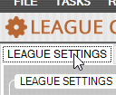

# sim-batcher
Python package used to automate large batch tests for DDSPF 2016

## Quick Setup Guide
Requires:
* Python 3
* DDSPF 2016
* AutoHotKey

1. Download this code as a .ZIP file and extract it to a directory
2. Open the Command Prompt (cmd.exe) **as administrator** and navigate to that directory ("cd \<directory\>")
3. Run `pip install -r requirements.txt --user`
4. Open up the settings.py file in the text editor / IDE of your choice and change the filepaths as needed
5. Open DDSPF and load the league you want to use (DSFL only at present)
6. Launch utils/MousePosWatch.ank.ahk script, press Ctrl-J to start it, and use it to identify the mouse coordinates needed for settings.py (Press Esc to exit the MousePosWatch script)
7. Open the Configuration menu in DDSPF and count how many tabs it takes you to reach the "Enable Personalities" box. Put this number in ENABLE_PERSONALITIES_TABS in settings.py.
8. Press "Alt-F" to open the File menu dropdown, then count how many times you need to press the "Left" button to get to the "Export" menu dropdown. Put this number in LEFT_PRESSES_TO_EXPORT in settings.py.
9. In the Command Prompt, run `python batchtest.py input/exampleStrats.py --home KCC --away MIN -N 50` (or you can use any other team codes you want for home/away)
10. Message me on Discord if you have any issues to this point. Otherwise start defining your own strategies and running your own sim tests!

## Introduction

sim-batcher is a Python 3 package that allows for large-scale batch testing of multiple strategies in DDSPF 2016. The general way that it works is through a combination of the Python [autohotkey package](https://github.com/spyoungtech/ahk) and custom Python code that allows for representations of strategies as Python objects and interfaces with the simulator.

To run a batch of tests, the main command that is used is:

`python batchtest.py [STRATEGY_FILEPATH] -H [HOME_TEAM_CODE] -A [AWAY_TEAM_CODE] -N [NUM_TESTS] -O [OUTPUT_FILEPATH]`

What this does is:

1. Read in the Strategies defined at STRATEGY_FILEPATH and convert them into Python objects
2. Simulate a number of games equal to NUM_TESTS between the specified teams
3. Record the data to OUTPUT_FILEPATH (this is done as tests are ongoing, so if the sim tests are interrupted for some reason the output for the completed tests will still be saved there)
4. Displays summary statistics for each strategy used upon completion of all the tests

Note: The -N and -O arguments are optional. The default number of tests per strategy is 500 and the default output filepath is defined in settings.py (starts as output/Results.csv).

## Configuration

This code is written for Python 3 and requires a copy of DDSPF 2016 to run (so it can simulate the games). This code requires the Python packages [ahk](https://github.com/spyoungtech/ahk), numpy, and pandas.

### Settings

The settings.py file contains most of the parameters that should remain the same across runs. These include:

1. GAME_APPLICATION_PATH, the filepath of the DDSPF .exe application file.
2. GAME_OUTPUT_FILE, the filepath of the Games.csv file for the league. **IMPORTANT: The league must be listed first alphabetically in the game's dropdown menu for it to be reloaded upon hitting the maximum games simulated for one batch of tests.**
3. RESULTS_FILE, the target .csv filepath to save the game output to. (Can optionally be specified here, but is overridden by the -O flag in the command line execution)
4. MAX_ITERS, an upper bound on the number of games that can be run on one league load without the game crashing. If the number of sim runs (-N flag) is specified to exceed MAX_ITERS, the code has methods to run a number smaller than MAX_ITERS multiple times to reach the total target number of simulated games for each strategy.
5. ENABLE_PERSONALITIES_TABS, the number of tabs needed to reach the "Enable Personalities" checkbox with the Configuration menu open. (Apparently this number can vary depending on whether the FOCUS_COORDINATES clicks on the "League Settings" tab or not, usually either 16 or 17.)
6. LEFT_PRESSES_TO_EXPORT, the number of presses of the "Left" button it takes to reach the Export dropdown menu from the File dropdown menu. This number also varies and we have no idea why. The possible known values so far are 3 and 7.
7. Some coordinates for specific buttons in the game window. Since not everything can be accessed via keyboard shortcuts, several mouse clicks are needed throughout the simulation loop.

These coordinates may change depending on screen size, resolution, etc. The provided autohotkey script "MousePosWatch.ank.ahk" in the utils/ folder can be used to find the x- and y- values for each button for your specific setup. With AutoHotkey installed, simply launch the script by double-clicking the file, press Ctrl-J to start the mouse tooltip, record the coordinates specified in the comments, and press Esc to exit the script once you're done.

For the FOCUS_COORDINATES, it seems to work most consistently if you ensure that the coordinates are above the "League Settings" tab shown below on the Configuration screen. From here the default 16 tabs to reach Enable Personalities should work consistently.



8. Delay settings. Sometimes the DDSPF window is doing some stuff and needs time. These settings specify how long the code waits for those tasks to finish.

### Strategies

An example strategy definition can be found in input/exampleStrats.py . The input is formatted as a list of Python dictionaries, where each dictionary contains a home strategy and/or an away strategy, plus a title for that test. The strategy is itself a Python dictionary meant to resemble how they are formatted in the game:

```
{
	DOWN_AND_DISTANCE: (OFFENSIVE_PLAYBOOK, RUN_PASS_RATIO, DEFENSIVE_PLAYBOOK, BLITZ_RATIO),  
	...  
}
```

The settings for the run/pass ratio and blitz/ratio should be integers. The rest can use pre-defined constants that are found in backend/strategyConstants.py. Hopefully they should be fairly intuitive to use (FIRST_AND_TEN, VERTICAL_PLAYBOOK, THREE_THREE_FIVE_PLAYBOOK, etc.)

Either home strategies, away strategies, or both can be defined **for all tests**. If you, for example, define a home strategy for the 1st element of the list and an away strategy for the 2nd element of the list, things will go badly. If either home or away strategies are not defined, then whatever is currently in the league file will be used.

## Data

The output saved to OUTPUT_FILENAME (default output/Results.csv) is basically a concatenation of all of the Games.csv files created by DDSPF during the runs. This file is saved to after each batch of sim tests, so if the program should terminate in the middle of a run the data that had been completed up to that point won't be lost.

## Team Codes

Currently only the DSFL team codes are implemented in the code. They are:

DAL - Dallas Birddogs  
KCC - Kansas City Coyotes  
LDN - London Royals  
MBB - Myrtle Beach Buccaneers  
MIN - Minnesota Grey Ducks  
NOR - Norfolk Seawolves  
POR - Portland Pythons  
TIJ - Tijuana Luchadores

## Miscellaneous

There are built-in failsafes for a few failure modes I've found so far which will allow the program to recover, reload the game, and run more tests if the game should crash for some reason.